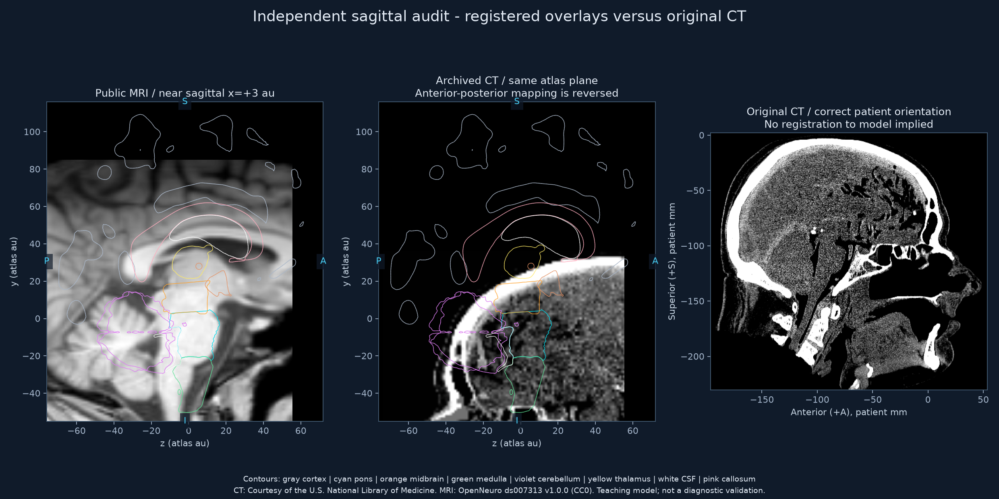
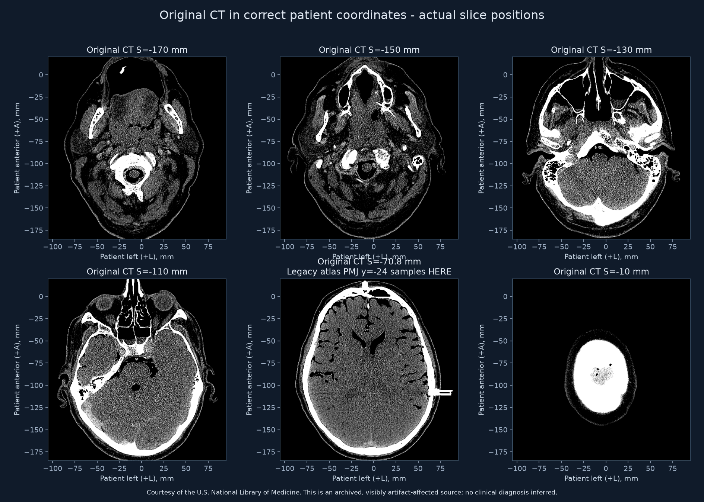
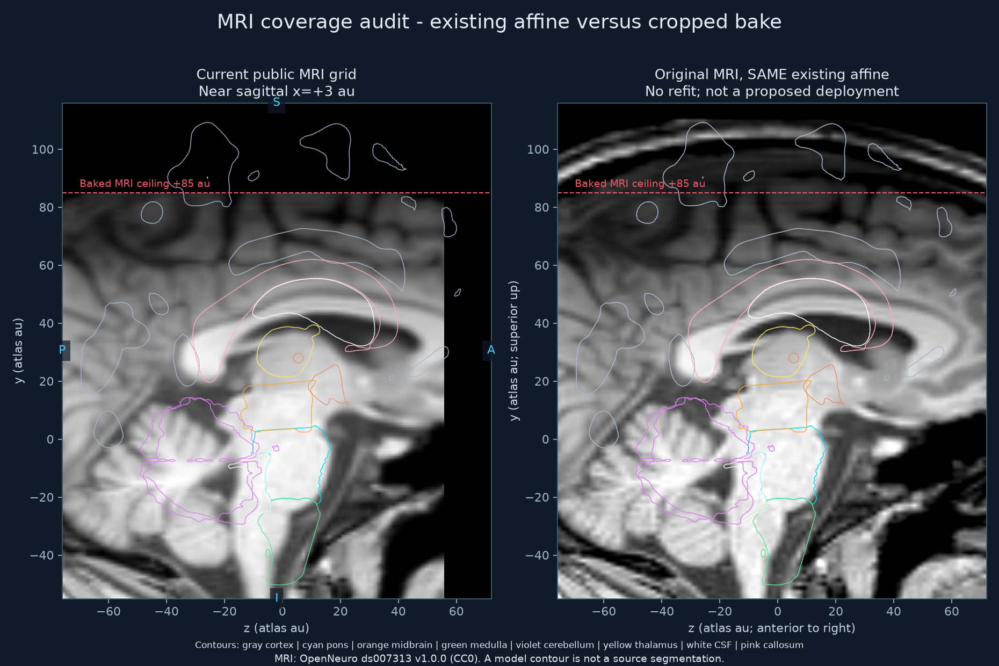

# NeuroAxis: CT, MRI and simulated section registration review

**Date:** 4 October 2026 (America/Los_Angeles).

**Audited application revision:** `89e5f655043817a328915adfad0c8bd3a10485e1`.

**Status:** ready for owner review; no runtime changes or deployment.

**Review:** [interactive report](index.html), [measurements](measurements.json), [coverage table](coverage.csv).

## Decision

**The current registration cannot receive a whole-brain accuracy sign-off.** Two substantial problems are confirmed in the archived CT pipeline: an anterior/posterior reflection and a superior/inferior placement that samples the wrong part of the head. Public MRI orientation is consistent with the atlas convention, but its displayed field crops part of the current cortical model, and its forebrain contours do not consistently follow the MRI anatomy.

The simulated cuts agree with the model's geometry and plane coordinates. That is useful engineering evidence; it does not establish that every model surface, nucleus or tract occupies its true anatomical position. The visible MRI brainstem fit is broadly compatible in several central sections. It does not warrant changing the MRI affine solely to resemble the incorrectly placed CT.

This review preserves all application assets, imagery controls, defaults, registration constants and scientific records. CT and photographs remain excluded from the public app; the 3D inset continues to show simulated sections only. Existing on-screen wording already describes MRI alignment as approximate.

## Findings and recommendations

| ID | Assessment | Evidence | Recommendation for review |
| --- | --- | --- | --- |
| R1 | **Confirmed substantial error: archived CT orientation** | DICOM is LPS: positive patient y points posteriorly. The baker assigns this to positive atlas z, although atlas z is declared anterior. An independent reconstruction matches all 126,198 sampled CT grid stations exactly. | Correct conversion to `(x_LPS, z_LPS, -y_LPS) / 1.2`. Re-estimate the CT registration afterward; changing the sign while retaining the old translation would still be wrong. |
| R2 | **Confirmed substantial error: archived CT placement** | Atlas pontomedullary level y=-24 currently samples patient superior coordinate -70.8 mm, a supratentorial cerebral section in the original CT. Source CT ends at atlas y=36.667 under the old translation; levels +48/+58/+68/+78 have no source coverage. | Refit using recognizable skull-base and brain landmarks. Retire the claim that the full head scan simply lacks upper-head acquisition coverage. Keep CT unavailable until reviewed. |
| R3 | **Confirmed public MRI field mismatch** | Baked field ends at y=+85, x=±49.091 and anterior z=+55.818 au. Model cortex reaches y=+113.757, x=-56.051/+55.475 and z=+70.709 au. 23.28%/23.64% of left/right cortical vertices fall outside the grid. | Prepare a field extension as a separate candidate, retaining the current affine and existing grid stations initially. Review native FOV and tissue coverage; extending the box alone will not fix the geometry mismatch. |
| R4 | **Visible mismatch: whole-brain MRI/model correspondence** | In sagittal and coronal comparisons, several cortical, callosal and cerebellar contours depart from the corresponding tissue boundaries. The full source MRI confirms this is partly anatomical placement/shape mismatch, beyond the bake crop. | Review model macrogeometry and imaging registration together. Use independent landmarks distributed across brainstem, ventricles and forebrain, with some landmarks held out from fitting. No speculative global or per-plane warp was applied. |
| R5 | **Previous metrics do not validate anatomical accuracy** | The old fitter compares a union of brain model parts with thresholded head intensities. CT cutoff uint8≥8 in window [-20,100] is approximately -16.24 HU; the code comment's 14 HU is incorrect. Gradient-based CT "pons" gates can select another tissue edge under R2's placement. | Replace acceptance evidence with identifiable anatomy, segmentation boundaries where available, coverage and orientation checks. Do not present threshold-mask IoU as a percentage of anatomical accuracy. |
| R6 | **Small source geometry approximation: CT slice positions** | Adjacent CT positions include 0.5, 1.0 and 1.5 mm steps. A single mean step produces a maximum position error of 1.458 mm. IOP and pixel spacing are consistent; there are no duplicate positions. | Use actual ImagePositionPatient positions when resampling. This is a small correction compared with R1/R2 and fits the user's tolerance for minor imperfections. |
| R7 | **Negligible numerical tradeoff** | Rounded spacing in the consumer manifest displaces the last station by at most 0.00257 au. Independent MRI reconstruction agrees within one gray level at every sampled station. | No change needed for the rounding or quantization difference. |

Priority describes the severity of the observed registration issue, not a diagnosis or a new clinical standard. R1/R2 concern archived CT; R3/R4 concern the MRI/model correspondence available publicly.

## Visual evidence

### Same model plane, different data sources



Left: the public MRI grid and independently cut model contours at x=+3 au. Center: archived CT sampled at exactly that atlas plane. Right: original CT in correctly oriented patient coordinates, without a model overlay or an implied registration. The CT bone outline crosses structures labeled as midbrain/pons under the archived transform; this is not a slight difference in biological shape.

### Original CT: the named level is sampling a different anatomical region



This figure uses actual slice positions and correct patient orientation. The panel at S=-70.8 mm is the source location selected by atlas y=-24 under the old transform. Its cerebral hemispheres and lateral ventricles establish a gross level mismatch. More inferior source panels show the cervical and posterior-fossa progression. Dark regions and artifacts also limit fine soft-tissue assessment in this archived source; no cause or clinical diagnosis is inferred from them.

### MRI bake crop versus original MRI



Both panels use **the same existing MRI affine**. The dashed ceiling is y=+85 au. The original MRI contains additional superior image data, but several cortical model contours still lie beyond the corresponding brain tissue. Source field coverage is not equivalent to cortical coverage or a successful registration. Approximately 0.31% of cortical vertices are outside even the original MRI FOV under this affine.

### All teaching levels and additional orthogonal sections

- [Teaching levels 1–6](teaching-levels-1.png): y=-50, -46, -42, -34, -24, -18.
- [Teaching levels 7–12](teaching-levels-2.png): y=-8, +2, +8, +14, +19, +28.
- [Teaching levels 13–17](teaching-levels-3.png): y=+36, +48, +58, +68, +78.
- [Coronal comparisons](coronal-overview.png): z=-30, 0, +30.
- [Parasagittal comparisons](parasagittal-overview.png): x=-15, +15.

These comparisons include cortical context, pons, midbrain, medulla, cerebellum/vermis, thalami, callosum and ventricular contours. Colors and anatomical direction labels appear on the figures. The plots use equal aspect and atlas coordinates; no separate two-dimensional fitting was performed for any image.

## Regional interpretation

| Region / structure | What this round supports | What remains unresolved |
| --- | --- | --- |
| Midline, axes and plane synchronization | MRI uses the declared left/superior/anterior convention; source-grid reconstruction and shared-plane tests agree. | An atlas midline can coincide while all other landmarks remain displaced. |
| Pons / midbrain | Several MRI central sections show compatible gross silhouettes, supporting retention of the existing local fit for review. | Detailed contour agreement, lateral extent, brainstem tilt and transition levels are not independently certified. CT's prior local gates are invalidated by the gross level mismatch. |
| Medulla / cervicomedullary transition | Simulated contour progression is computationally consistent; MRI gives useful gross context. | Stylized lengths, small internal nuclei and exact decussation coordinates cannot be established from these overlays. |
| Cerebellum / vermis | Gross posterior relation to brainstem and fourth ventricle is recognizable in MRI. | Superior/inferior and lateral contour mismatches remain visible. |
| Thalamus / basal forebrain / callosum | Macrostructures and some source landmarks can be recognized on MRI. | A brainstem-tuned anisotropic affine does not establish a reliable whole-forebrain fit; several boundaries diverge. |
| Ventricles | Relative ventricular anatomy can be reviewed on MRI; native CT demonstrates the wrong atlas level in R2. | Individual horn shape, CSF spaces and correspondence to each model surface need independent landmark or segmentation review. |
| Cortical ribbon / regions | Model fields, coordinates and contour generation were inspected; field mismatch is measured. | Current contours are teaching geometry, not subject-specific cortical segmentation. Sulci, gyri and cortical areal boundaries cannot be validated against this CT by contour proximity alone. |
| Fine nuclei, nerves, vessels, tracts and functional pathways | These continue to be pedagogic structures in the simulated view. | This round does **not** validate their exact location, shape, course or functional connectivity. The available noncontrast CT and downsampled T1 overlay cannot establish all such details. Prior content references remain relevant. |

## Methods and reproducibility

1. Read all **463 original gzipped CT DICOM files**. Sort by physical position along the orientation normal. Inspect IOP, IPP, pixel spacing, rescale values, duplicates and spacing gaps. Decode HU using slope/intercept, independently of the JavaScript parser.
2. Read the original **176×280×288** NIfTI T1 volume with nibabel. Its stored axis codes are R/A/S; qform and sform codes are 1. Inspect the affine rather than infer orientation from filenames or display thumbnails.
3. Reconstruct the legacy canonical CT affine and current MRI affine in Python. Sample **126,198 deterministic grid stations per modality** from the original volumes, then compare with committed uint8 files. CT: 100% exact. MRI: 98.68% exact and 100% within one gray level; rounded recorded window limits explain this small tolerance. This confirms the data paths being audited; it is not anatomical validation.
4. Load **all 138 GLBs**, honoring scene-node transforms. Inspect native and baked image field coverage for every mesh vertex. Derive visual contours with an independent triangle/plane intersection implementation.
5. Inspect all **17 transverse teaching planes**, three sagittal/parasagittal planes and three coronal planes. Also inspect native CT axial sections and unbaked MRI under the current affine. Macroanatomical interpretation was cross-checked against the user's Haines and Blumenfeld references.
6. Run the application's own verification: `npm run verify:pipeline` passed for 138/138 parts, 599,204 triangles and 386 loops across 13 test planes, with zero problems. `npm run verify:plane` passed 10,827 assertions. These test plane transforms and contour mechanics. Legacy camera assertions in the latter do not constitute registration evidence; current PiP uses the shared 2D SectionCanvas.

The measurements file records source and baked-volume hashes, complete CT geometry summary, affines, all 138 mesh field checks and all 34 modality/teaching-level coverage cases. `coverage.csv` provides the same per-level coverage numbers for convenient review. **Vertex fractions are not tissue-volume percentages.** A nonzero CT display pixel can include air encoded as sentinel 1; it is not evidence of brain tissue. The figures use a full 0–255 grayscale window; changing the app's display contrast or opacity does not change physical registration.

### Re-run without changing app assets

This is the historical audit of published revision `89e5f65`. The script reads
its image assets from that Git revision even after candidate changes exist.
For the new implementation and current source resampling checks, use
`../2026-10-04-registration-candidate/README.md` and `registration_candidate.py`.

Install the optional Python requirements in an isolated environment, then run from the repository root:

```powershell
python -m pip install -r scripts/audit/requirements-registration.txt
python scripts/audit/registration.py `
  --repo . `
  --sources 'D:\Startup projects\3DNeuroanatamoy' `
  --out '<review-output-directory>' `
  --cache-dir '<scratch-directory-outside-repository>'
```

The source directory must contain `assets-src/imaging2/vhp-ct/J.*.gz` and `assets-src/imaging/mri/sub-A006_T1w.nii.gz`. The audit writes figures and JSON only to the output directory. Its raw CT cache must be outside the repository. It refuses a cache inside the repo and verifies the aggregate compressed-source hash before reusing a cache. Do not run the older image bakers to reproduce this report: they rewrite atlas assets.

## Proposed next work after owner review

1. Fix archived CT orientation and physical slice interpolation, then establish a **new, reviewed** CT-to-model registration. Use the correct source coordinate system first, and verify tissue identity in all three planes. CT remains excluded from the app during that work.
2. Prepare an MRI field extension while preserving all existing grid station positions and the initial MRI affine. Compare original stations byte-for-byte and quantify newly available tissue coverage. Treat the diagnostic full-source figure as a starting point, not an accepted fix.
3. Resolve whole-brain macrogeometry and registration using a distributed set of visible landmarks: brainstem junctions and faces, fourth ventricle, callosal genu/splenium, lateral ventricular horns, cortical poles/vertex and bilateral boundaries. Reserve some landmarks for independent evaluation. An adjustment to improve the cortex must also be checked against the existing brainstem fit.
4. Record per-region acceptance, tolerated residuals and unresolved structures. Tolerances should be agreed for a teaching atlas; they are not a clinical registration standard. Avoid independent per-plane warps, which can conceal inconsistent three-dimensional geometry.
5. Submit the candidate application and comparisons for owner review before merging or deploying.

**This audit applies no proposed correction.** The public MRI/simulated tool stays at the previously approved revision until the owner reviews next steps.

## Sources and rights

- [DICOM PS3.3 C.7.6.2, Image Plane Module](https://dicom.nema.org/medical/dicom/current/output/chtml/part03/sect_C.7.6.2.html): patient-axis convention and physical image geometry. Checked 4 October 2026.
- [NLM Visible Human data access](https://www.nlm.nih.gov/research/visible/getting_data.html) and [NLM Terms and Conditions](https://www.nlm.nih.gov/databases/download/terms_and_conditions.html): archived Additional Head Images CT. **Courtesy of the U.S. National Library of Medicine.** This is a historical dataset; the report does not claim it is current clinical ground truth. NLM has not endorsed NeuroAxis or this audit.
- [OpenNeuro ds007313 v1.0.0](https://openneuro.org/datasets/ds007313/versions/1.0.0), DOI `10.18112/openneuro.ds007313.v1.0.0`: single-participant brain/spinal-cord T1. Public `dataset_description.json` was checked and states CC0. MRI and CT are different sources and subjects, not paired acquisitions.
- [ITK Software Guide, registration chapter](https://itk.org/ITKSoftwareGuide/html/Book2/ITKSoftwareGuide-Book2ch3.html): physical-space transforms and correspondence of homologous anatomy. The recommendations for held-out landmarks are the audit's own methodological recommendation, not a claim that an ITK example clinically validates this atlas.
- Haines, *Neuroanatomy: An Atlas of Structures, Sections, and Systems*, 8th ed. (2012), printed pp. 130–131 (pons with MRI/CT) and 176–177 (axial/sagittal correlations). User-supplied PDF pages 144–145 and 190–191.
- Blumenfeld, *Neuroanatomy through Clinical Cases*, 2nd ed. (2010), printed p. 494, Figure 12.1 (brainstem in situ). User-supplied PDF page 520.

Textbook pages were consulted locally and are not reproduced in this report. Figures are independently generated from the public CT/MRI sources and existing NeuroAxis models. Rights in third-party source imagery remain governed by their own terms.
